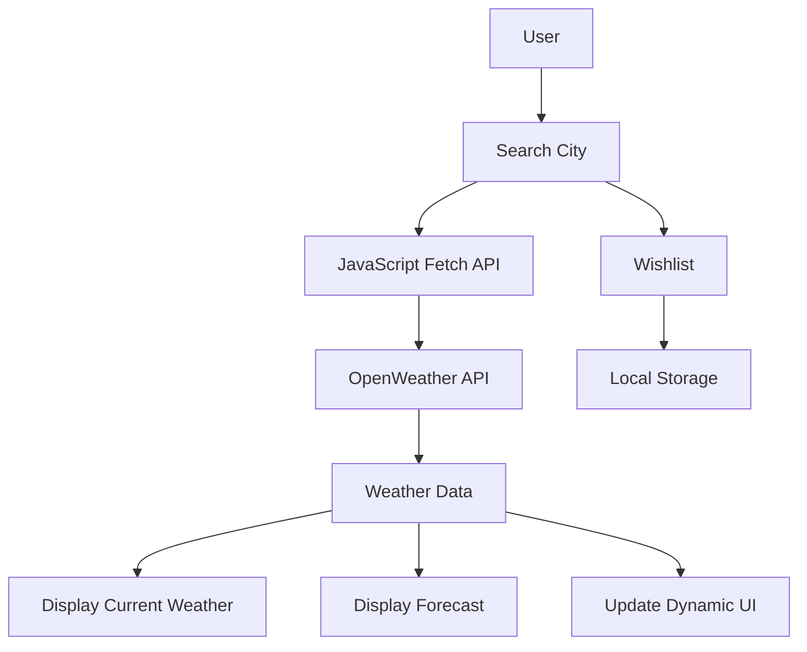

<div align="center">

# ☁️ SkyCast

### 🌦️ Real-Time Weather Forecast Application


<br>


<br>


<br>

### 🚀 A sleek and interactive weather application providing real-time weather information and personalized forecasts.

</div>

---

# 📑 Table of Contents

- [📌 Overview](#-overview)
- [🎯 Problem Statement](#-problem-statement)
- [💡 Solution](#-solution)
- [🎥 Demo](#-demo)
- [✨ Features](#-features)
- [🛠 Tech Stack](#-tech-stack)
- [📸 Screenshots](#-screenshots)
- [🏗 Project Architecture](#-project-architecture)
- [📂 Folder Structure](#-folder-structure)
- [⚙ Installation](#-installation)
- [🚀 Future Enhancements](#-future-enhancements)
- [👨‍💻 Author](#-author)

---

# 📌 Overview

SkyCast is a modern weather forecasting web application that delivers:

🌤 Current weather conditions

📍 Location-based weather

📅 5-Day forecast

❤️ Favourite cities wishlist

🌡 Temperature, humidity, pressure & wind information

The application offers users a beautiful and intuitive interface to stay informed about weather conditions anytime.

---

# 🎯 Problem Statement

Many weather websites provide information in a cluttered and overwhelming manner.

Users often face:

- Poor UI experience
- Lack of personalization
- Difficult navigation
- Limited weather insights

---

# 💡 Solution

SkyCast solves these problems by providing:

✅ Clean and responsive UI

✅ Real-time weather updates

✅ Dynamic weather backgrounds

✅ Favourite cities management

✅ Accurate multi-day forecasts

---

# 🎥 Demo

## 🌦 Application Demo

> Replace this GIF with your own demo recording.

<p align="center">

</p>

---

# ✨ Features

## 🌤 Weather Information

- Real-time weather updates
- Current temperature display
- Weather condition icons
- Wind speed information
- Humidity level
- Atmospheric pressure

---

## 📅 Forecasting

- 5-Day weather forecast
- Daily temperature predictions
- Weather trends

---

## ❤️ Wishlist Feature

- Save favourite cities
- Quick weather access
- Persistent city management

---

## 🎨 Dynamic User Experience

- Responsive design
- Modern UI
- Dynamic backgrounds
- Smooth animations
- Mobile-friendly layout

---

# 🛠 Tech Stack

<div align="center">

| Technology | Purpose |
|------------|---------|
| HTML5 | Structure |
| CSS3 | Styling |
| JavaScript | Functionality |
| OpenWeather API | Weather Data |
| Local Storage | Wishlist Persistence |

</div>

---

# 📸 Screenshots

## 🏠 Home Page

<p align="center">

</p>

---

## 🔍 City Search

<p align="center">

</p>

---

## 📅 Forecast Screen

<p align="center">

</p>

---

## ❤️ Favourite Cities

<p align="center">

</p>

---

# 🏗 Project Architecture



---

# 📂 Folder Structure

```bash
SkyCast-WeatherApp/

│── index.html
│── style.css
│── script.js
│── bg.jpg
│── README.md
```

---

# ⚙ Installation

## Clone Repository

```bash
git clone https://github.com/Hardikk1508/SkyCast-WeatherApp.git

cd SkyCast-WeatherApp
```

---

## Run Locally

Simply open:

```bash
index.html
```

or use VS Code Live Server.

---

# 🔑 API Setup

1. Create an account at:

https://openweathermap.org/

2. Generate API Key.

3. Add API key inside:

```javascript
const API_KEY = "YOUR_API_KEY";
```

inside:

```bash
script.js
```

---

# 🏆 Key Highlights

✅ Real-time Weather API Integration

✅ Dynamic Weather Forecasting

✅ Wishlist Functionality

✅ Responsive UI Design

✅ Local Storage Integration

---

# 🚀 Future Enhancements

- 🌍 Geolocation Support
- 🎙 Voice Search
- 🌙 Dark/Light Theme Toggle
- 📈 Hourly Forecast
- 📡 Air Quality Index
- 🌧 Rain Probability Analysis

---

# 👨‍💻 Author

## Hardik Bhardwaj

🎓 MCA (AI & ML) Student

💻 Full Stack Developer

🤖 AI/ML Enthusiast

---

# 🌐 Connect With Me

<div align="center">

[](https://github.com/Hardikk1508)

[](https://linkedin.com/in/YOUR_LINKEDIN_PROFILE)

</div>

---

<div align="center">

## ⭐ Don't forget to star this repository if you like it!


</div>
